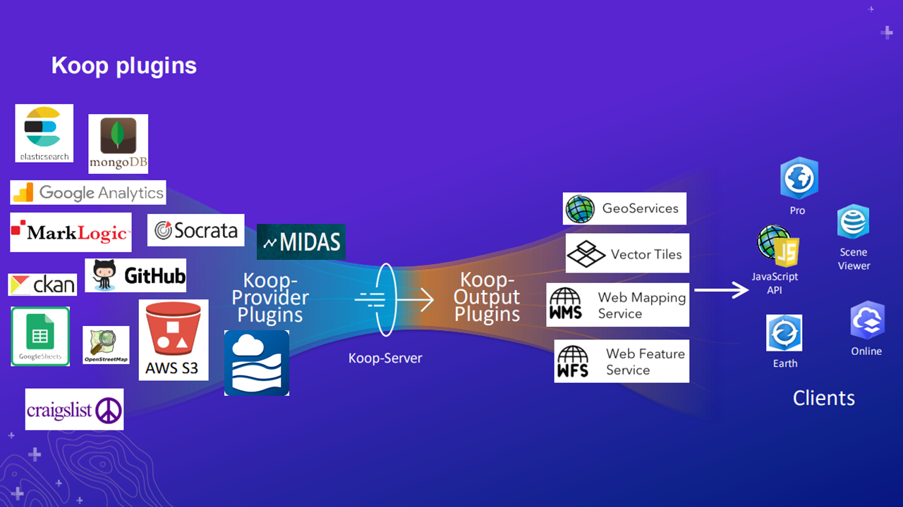

# Koop-Provider-OpenGround


<ins>**Defining the problem**</ins>: Inability to easily incorporate up-to-date boring data hosted on OpenGround Cloud with project GIS viewers

<ins>**Creating the solution**</ins>: Koop provider that pulls the needed data from the OpenGround database, translates it to an ESRI readable format, then hosts it at a link accessible by a feature class

## What is Koop?
Koop is a JavaScript toolkit built on Node.js for connecting spatial APIs — in this case connecting OpenGround Cloud boring data to ArcGIS Pro and online ESRI viewers. More information about Koop can be found on their [main GitHub page](https://koopjs.github.io/). There are also several great conceptual diagrams in [this presentation](https://www.esri.com/content/dam/esrisites/en-us/events/conferences/2020/developer-summit/use-koop-to-connect-any-data-source-to-arcgis.pdf). The ultimate purpose of Koop is to allow for interoperable systems.

**What is a Koop Provider?** A "provider" is a term used by Koop to describe a set of code that requests data and converts it to GeoJSON. All API requesting, data translating, and hosting are accomplished behind the scenes of this Koop-OpenGround-Provider running on a Node.js server.

**How is the OpenGround Data Accessed?** All data is hosted on a USACE cloud, Bentley owned server. To access the data, we must provide authentication and a request to the OpenGround API. This allows us to request the data we need from the API and have it returned to us in a usable, JSON format. More information about the API [can be found here](https://documenter.getpostman.com/view/5790939/RzfniRf1) This provider is configured using service account credentials (NOT included in this repo due to security concerns).

Modified conceptual diagram of how Koop accesses USACE data and serves it up for access:


## Current Build Status
This provider is in the later stages of development and will soon be moving to a production Beta release.

| Development Task | Status |
| -------- | --------|
| Pull data from the OpenGround API into Koop |  |
| Merge data and translate to GeoJSON format |  |
| Filtering null coordinates and handling errors |  |
| Adding a projects provider |  |
| Correctly configure projects provider |  |
| Have Koop provide ESRIGeoJSON output at an accessible link |  |
| Configure application to utilize service account credentials |  |
| Create README for documentation |  |
| Create connection to AGOL feature class |  |
| Gain access to Node JS server |  |
| Add table and JSON output service |   |
| Wire up machine credentials to access USACE cloud |  |
| Test Koop on a CorpsNet Node.js server |  |
| QA check data and locations |  |
| Long term testing |  |

## About This Repository
This repository is different from other Koop providers. It is currently setup with a server that registers the following:
``` javascript
const flat = require('./koop-output-flat') // this was manually imported to grab a fixed version
const tableOut = require('./koop-output-table') //https://github.com/ryanbenac33/koop-output-table

const riverGagesProvider = require("./koop-provider-RiverGages") //https://github.com/ryanbenac33/koop-provider-RiverGages
const gagePicker = require("./koop-provider-RiverGages/sub-provider-gagePicker") //https://github.com/ryanbenac33/koop-provider-RiverGages -- this is a sub provider for locations
```
These are being developed for deployment. Once deployed, this repository will be reorganized to include only code for the OpenGround provider.


## Setting Up Koop
**Important**: This repo has an INCOMPLETE config.json file and does not include neccessary modules. Contact the owner of this repo for the complete config.json file which will give the application access to utilize the service account.

Koop runs on the Node JS platform. Clone this repo (and add the missing config file and module files specifed above) and save them to...*more to come*

This provider also requires the cloning of this repo: [https://github.com/ryanbenac33/koop-output-table](https://github.com/ryanbenac33/koop-output-table) in your working folder (as a sub folder in this cloned master).

Koop data is initialized on a CorpsNet server which means that any OpenGround data accessed using this middleware is only accessible to those on the CorpsNet.

### Accessing Boring Data URL
This Koop Provider actually ships with two providers: one for boring data and one for project data. All data can be viewed and accessed using a web browser (Google Chrome is recommended). Data is requested and accessed by correctly formatting a URL link in the following format (*this link will be replaced by the production environment link*):

`http://localhost:8080/opengroundcloud/rest/services/PROJECT_UID::DATA_TABLE/FeatureServer/0/query`

- **8080** is the default port the server will listen on. This is configurable in `config/default.js`
- **PROJECT_UID** is a unique identifier (UID) for a project. To lookup the UID for a specific project, use this link: *more to come*
- **DATA_TABLE** is the OpenGround data table information you want to access. Currently, the provider is only configured to handle the "LocationDetails" input, however future version may expand functionality as needed

This provider ships with several output options which allows the end user a variety of ways to access the data. Output links are formatted slightly different from one another:

Feature Class: [`http://localhost:8080/opengroundcloud/rest/services/c613f0c4-e46d-4a7a-8e67-f7c9501169d0::LocationDetails/FeatureServer/0/query`](http://localhost:8080/opengroundcloud/rest/services/c613f0c4-e46d-4a7a-8e67-f7c9501169d0::LocationDetails/FeatureServer/0/query)

Flat JSON: [`http://localhost:8080/opengroundcloud/77fd1c62-18d4-4bd5-ba58-ae1d01382c56::LocationDetails/flat`](http://localhost:8080/opengroundcloud/77fd1c62-18d4-4bd5-ba58-ae1d01382c56::LocationDetails/flat)

Table: [`http://localhost:8080/opengroundcloud/77fd1c62-18d4-4bd5-ba58-ae1d01382c56::LocationDetails/table`](http://localhost:8080/opengroundcloud/77fd1c62-18d4-4bd5-ba58-ae1d01382c56::LocationDetails/table)

### Accessing Project Data URL
You might be wondering, how can I find the unique project ID (UID) for a specific project? This repo provider also contains a sub-provider which pulls all existing projects and their UID into a table which a user can then access and find the needed UID. To access this link, use the following URL (*this link will be replaced by the production environment link*): 

`http://localhost:8080/opengroundprojects/rest/services/projects/FeatureServer/0/query`

- **8080** is the default port the server will listen on. This is configurable in `config/default.js`
- **projects** is the literal term used to request projects at this URL (see example below)
  
This provider ships with several output options which allows the end user a variety of ways to access the data. Output links are formatted slightly different from one another:

Feature Class: [`http://localhost:8080/opengroundprojects/rest/services/projects/FeatureServer/0/query`](http://localhost:8080/opengroundprojects/rest/services/projects/FeatureServer/0/query)

Flat JSON: [`http://localhost:8080/opengroundprojects/projects/flat`](http://localhost:8080/opengroundprojects/projects/flat)

Table: [`http://localhost:8080/opengroundprojects/projects/table`](http://localhost:8080/opengroundprojects/projects/table)

### Example Data
This repo also contains an example JSON response from the borings provider using the project link above. That file is found in `example-data/boringData.txt`.

## Accessing the Data as an AGOL Feature Class
Once the server is running, any requested data is hosted at a link formatted as above. To setup this data as an AGOL (ArcGIS Online) feature class connection, follow the steps below:

1. Open and copy the project boring URL you will turn into a feature class. Be sure the link starts with https://

2. Login to either your AGOL portal of your USACE ESRI portal

3. Go to the Content tab and choose "Add Item"

4. *Next steps are still in development*

## Configuring the Provider for a Server
*Server and production environment steps are still in testing and development*

## Interpreting Unexpected Responses and Errors
Most errors will be caught and explained by the program either displayed in the URL link or the server terminal. Common examples of errors currently include the following:

1. **401 - Forbidden**: Your token is out of date and you should populate a new `token` in `config/default.json`
2. **Cannot GET**: This is usually accompanied by a white background and an error message. The URL you are trying to access cannot be routed through Koop. Verify you have the correct project UID and that it is formatted correctly

## Getting Started with Koop Development
This guide follows the steps to initialize development of this already created provider. To get started using Koop, it is highly recommended to do each of the following:
1. Read through Koop documentation including:
    - [Koop Quickstart Guide](https://koopjs.github.io/docs/basics/quickstart)
    - [Providers](https://koopjs.github.io/docs/usage/provider) documentation 
    - [Koop Core](https://koopjs.github.io/docs/usage/koop-core) documentation
2. [Download Node.js](https://nodejs.org/en/download) to your machine for testing the provider
   
3. Install a developer environment like [VS Code](https://code.visualstudio.com/download) to view the Provider .js code
   
4. [Download Google Chrome](https://www.google.com/chrome/) and enable the "Inspect" developer tool

5. *Optional*: [Watch this video](https://www.youtube.com/watch?v=mhdLEUuE3dk) for a visual demonstration of getting started. This is HIGHLY recommended if you intend to create your own provider of a specific data source.


### Initialize NPM and Koop CLI
This provider ships with the base provider and a server file. After following the quick start guide, be sure you have installed npm (Node Package Manager) which can be utilized through the CMD command line. In the CMD using npm, download and install the Koop CLI (command line interface) using: 

`npm install -g @koopjs/cli`

The out of the box outputs also require the following modules be installed via command or terminal line (in addition to any installed during an app initialization):

`npm install flat`

**Note:** There are known issues installing the above packages when connected to VPN. Disconnect VPN and use only network to install the necessary packages.

### Start the Server
One the files are ready and structured correctly, start the server and pulling data. Open `server.js` in VS Code and start a new terminal. In the terminal enter `node server.js`. This will initialize the server and register the provider. The terminal output will also provide an example link to access data.

### Accessing Data Locally
During development, you can specify a port that `server.js` should start listening on. Then, data can be accessed by the following link:
`http://localhost:8080/opengroundcloud/rest/services/PROJECT_UID::DATA_TABLE/FeatureServer/0/query`

- **8080** is the default port the server will listen on. This is configurable in `server.js`
- **PROJECT_UID** is a unique identifier for a project. To lookup the UID for a specific project, use this link: *LINK UNDER CONSTRUCTION*
- **DATA_TABLE** is the OpenGround data table information you want to access. Currently, the provider is only configured to handle the "LocationDetails" input, however future version may expand functionality as needed
  
Notice that this is being hosted on port 8080 (specified in the config file) as opposed to the production URL hosted on the CorpsNet.

### Testing Data Interoperability with AGOL
When in development, using the localhost URL to see the data output will work for a long period, but eventually you will reach a point where you want to see the tested data on AGOL (ArcGIS Online). AGOL requires data links to be provided via a secure https:// link. To get around this during testing, install `ngrok` in your working app directory. Ngrok creates a secure https link by tunneling through your machine to the port hosting the data. In this provider config file, set the `devMode` field to `true` to start ngrok when `server.js` is initialized. Now, you can follow the above AGOL connection steps using the ngrok link.